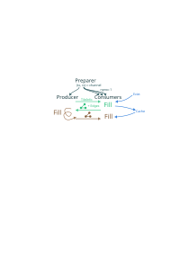

# Tiled interface for models

owh shoot, just realized why tiles also had their own special watershed 0
That is of course because tiles could be partially ocean and then they are also draining _internally_ to the edge of the grid.

Guess that's the next chapter...

## ramble

So there's a lot of cool things wrt hydrology and stuff, but by far the coolest is the development of tile-based hydrology algorithms, running hydrology client-side in wasm (rust) and Cloud-Optimized Geotiffs. 

One small problem is that given an area of interest, say a farm or city, you don't know -without something like hydrosheds- what catchment you're in or from where the water flows into your area. This is made more complex if the dem is not depression-filled. So a major question I have:

"Given an initial area, can you find all upslope cells in a non-depression-filled dem?"

I realized it may be possible with like a priority-flood if the area of interest _and_ the borders of tiles are added to the priority queue (BinaryHeap). The main problem of only adding the area of interest is that the priority flood algorithm assumes all water flows to the initial cells.

So that can actually be done by taking the Zhou depression filling algorithm (that has a slope plain queue), adding a boolean `is_roi` flag and initializing the slope queue with that. --I think...

Seeding the slope queue works well for finding a catchment within a single tile, but for multiple tiles, the graph structure `graph = Vec<HashMap<TLabel,T>>` where `graph[my_label]` gives the label's edges messes up with the roi flag. Let's leave that for a little bit later.

### implementation and modification of Barnes (2016)

So Barnes (2016) is tiled priority-flood depression filling.

- The preparer creates a/some channel(s), a single producer and some consumers
  1. consumers get a `TileInfo` struct and:
     - load the tile (async)
     - fill the tile (CPU)
     - report back a `Job1` struct
  2. producer fills the supergraph (CPU)
  3. Consumers get a `Job2` struct and:
     - load the tile (async) from cache/retain/evict*
     - fill the if required by `Job2` data (CPU)

So there's a mix of async and CPU, mainly in Job1: Tile loading is async and can take quite long, whereas filling is CPU bound. So creating a bunch of rayon threads for that may be wayy too slow... However, loading too many tiles at once may blow up the memory. There's actually two use-cases:

1. Parallelize depression filling of a huge DEM that doesn't fit in memory (OG use-case)
   - fast tile-loading
   - bust memory if all are loaded
2. fill depressions on a mosaiced DEM that is only available as tiled over a network (this use-case)
   - slow tile-loading
   - may also explode memory
   - cache may be fast

However, ideally we'd be able to support both in some way. However, I'm currently a bit stuck at the point where the basic idea of rayon - and thus the wasm-bindgen-rayon (is it bad to want to use rayon bc I don't care abt howto wasm multi-threading?) is work-stealing and -well- I could be work-stealing, but that's normally done from like a fixed, splittable workload... This model is more like a push-stuff-to-threads kind of thing...And threads in wasm is a bit of a pain, so ideally, I'd rayon that..

whatever, Let's just first get the producer-consumer thing working in some agnostic-ish way and then see howto rayon

## References

Barnes, R. (2016). Parallel Priority-Flood Depression Filling For Trillion Cell Digital Elevation Models On Desktops Or Clusters. Computers & Geosciences, 96, 56–68. https://doi.org/10.1016/j.cageo.2016.07.001
